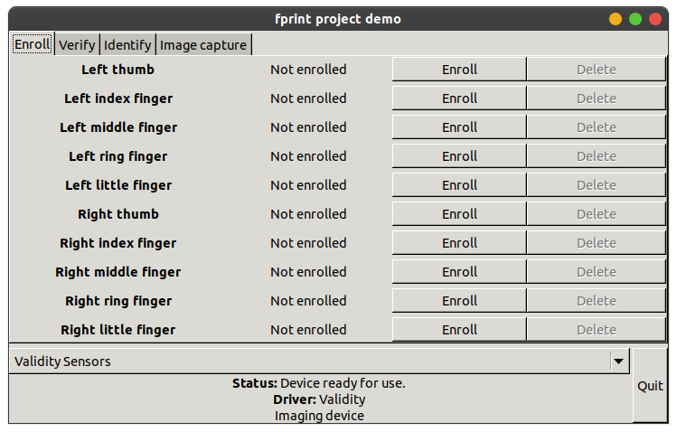

# These are the install instruction to get the vfs495 fingerprint working in modern ubuntu (or other distro) versions


First we install the necessary packages
```bash
sudo apt-get update && sudo apt-get install alien libssl1.1 libusb-dev libcrypto++-dev libssl-dev libglib2.0-dev libmagickcore-dev checkinstall libgtk2.0-dev libcanberra-gtk-module
```

Next we follow the steps by [this guide](https://askubuntu.com/a/924475):

Install the driver
```bash
tar xf vfs495.tar && \
cd vfs495 && \
sudo alien Validity-Sensor-Setup-4.5-118.00.x86_64.rpm && \
sudo dpkg -i validity-sensor-setup_4.5-119_amd64.deb
```

Create soft-links to newer packages to act as the required packages
```bash
sudo ln -s /lib/x86_64-linux-gnu/libssl.so.1.1 /lib/x86_64-linux-gnu/libssl.so.0.9.8
sudo ln -s /usr/lib/x86_64-linux-gnu/libcrypto++.so.6.0.0 /usr/lib/libcrypto.so.0.9.8
```

Install fprint
```bash
mkdir libfprint && \
cd libfprint && \
rpm2cpio ../libfprint-0.0.6-18.20.1.src.rpm | cpio -i --make-directories && \
tar xf libfprint-0.0.6.tar.bz2 && \
cp ../libfprint-validity.patch ./libfprint-validity.patch && \
cd libfprint-0.0.6/ && \
patch -p1 < ../libfprint-validity.patch && \
./configure --prefix=/usr && \
make && \
sudo checkinstall -install=no make install && \
sudo dpkg -i libfprint_0.0.6-1_amd64.deb && \
```

Install fprint_demo
```bash
cd ../.. && \
tar xf fprint_demo-0.4.tar.bz2
cd fprint_demo-0.4
./configure --prefix=/usr
make
sudo checkinstall -install=no make install
sudo dpkg -i fprint-demo_0.4-1_amd64.deb
```

Fix broken fprint_demo install, as it is an older package and relies on systems like rc.status and /sbin/<...>proc commands not found in modern ubuntu versions
```bash
sudo cp rc.status /etc/rc.status && \
sudo cp vcsFPServiceDaemon.fixed /etc/init.d/vcsFPServiceDaemon
```

At this point we can start to register our fingers. Make sure to call `fprint_demo` without sude, else the fingerprints will not be able to a non-root user, i.e. when logging in.
```bash
sudo /etc/init.d/vcsFPServiceDaemon start && \
fprint_demo
```

You should now be able to register fingerprints and test them under the "identify" tab. The enrolled fingerprints should look similar to this



> [!WARNING]
> Be very carefull when modifying your `/etc/pam.d/common-auth` file, as this might prevent you from logging into your system. Only proceed if you know what you are doing or if you have a bootable linux-usb to revert any changes.

Finally we need to modify `/etc/pam.d/common-auth` and add fingerprint authentication
```bash
# fingerprint authentication through fprintd
auth    sufficient                      pam_fprint.so
```

Make sure to add this at the beginning of your auth file just after the comment block at the beginning. An example file `common-auth.template` is located in the repository as reference
